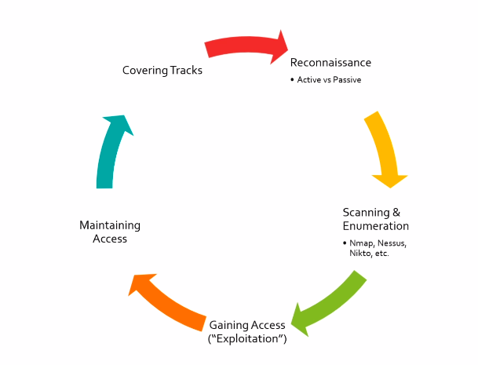

# **The 5 Stages of Ethical Hacking**
---

1. ## **Reconnaissance**
    - passive
    - just looking
1. ## **Scanning and Enumeration**
    - this is active recon
    - forcfully looking
    - reasearch exploits
1. ## **Gaining Access**
    - exploit security flaw to get in
1. ## **Maintain Access**
    - how to have access even when a user powers down a machine or service
1. ## **Covering Tracks**
    - delete logs
    - remove any malware/scripts
    - you were never there

***Wash, Rinse, and Repeat***