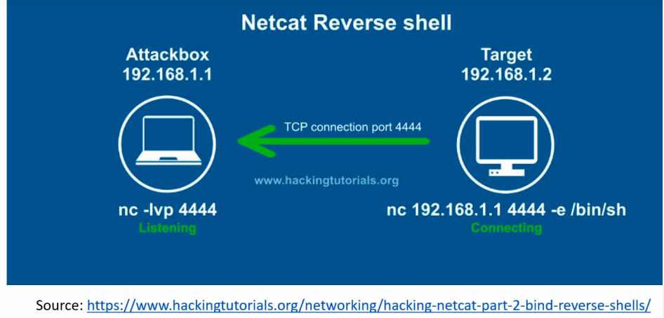
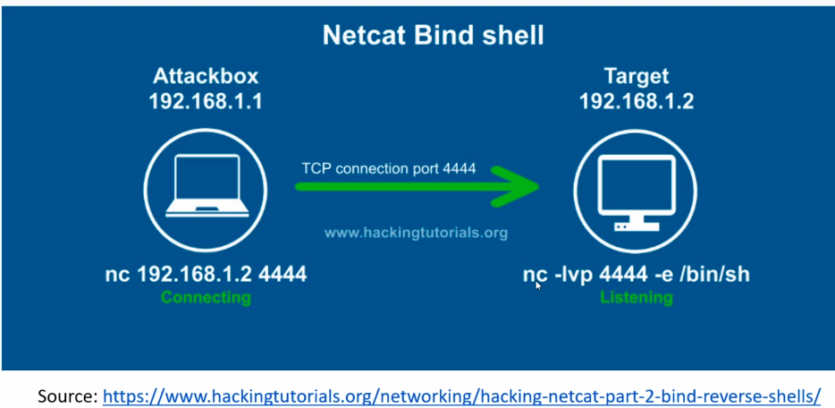

# **Exploitation Basics**
---
## **Reverse Shell**
--
- **Netcat Reverse Shell** 
    - Used 86% of the time
    - Reverse shell means that a victim connects to us
    - attack box is listening on a port
    - target connect to the listening port

- **Netcat Bind Shell**
    - Used mostly on external
    - useful when bypassing firewall
    - attacker opens a port on target to listen for traffic
    - attacker then connects to that port that is listening

---
## **Payloads**
- payloads are what we run as exploits
----
### **Non-Staged**
--
- Sends exploit shellcode all at once
- Larger in size and won't always work
- *EX:* `windows/meterpreter_reverse_tcp` 
### **Staged**
--
- Sends payload in stages
- Can be less stable
- *EX:*w `windows/meterpreter/reverse_tcp`

#### *THE DIFFERENCE IS THE `/`*
---
## **Gaining Root W/ Metasploit**
--
- `msfconsole`
    - `search <exploit>`
    - `use <exploit>`
        - `options`
        - `set <options>`
        - `run` or `exploit`
# **PORT: 4444 IS OBVIOUS ATTACKER DEFAULT METERPRETER PORT**
---
## **Brute Force Attacks**
- pretty much guessing
- `hydra -l <user> -P <passwd list> <connectionType://target:port -t 4 -V`
- run same thing in `msfconsole`
    - `search ssh`
    - `use ssh bruteforce`
    - `set params`
    - `exploit`
- **BRUTE FORCE IS NOISY**
---
## **Credential Stuffing**

- throw usernames and passwords at a website.
- look up and install: `foxyproxy` on firefox
    - in options add proxy called burpsuit
    - leave type http
    - 127.0.0.1
    - 8080
- use burpsuit to perform payload in intruder on burpsuite
- **Password Spraying**:
    - useing known usernames to spray passwords at
