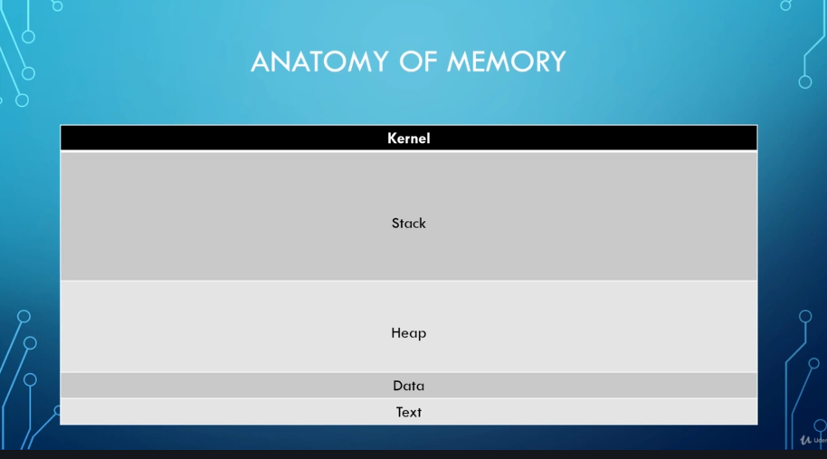
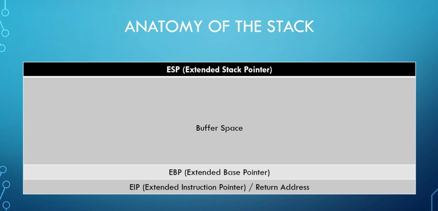

# **Buffer Overflow**
---
## **Anatomy of Memory**
> 

## **The Stack**
> 
---
## **Components of a buffer overflow attack**
---
### **Spiking**
### **Fuzzing**
### **Finding the Offset**
### **Overwriting the EIP**
### **Finding Bad Characters**
### **Finding the Right Module**
### **Generating Shellcode and Getting Root**