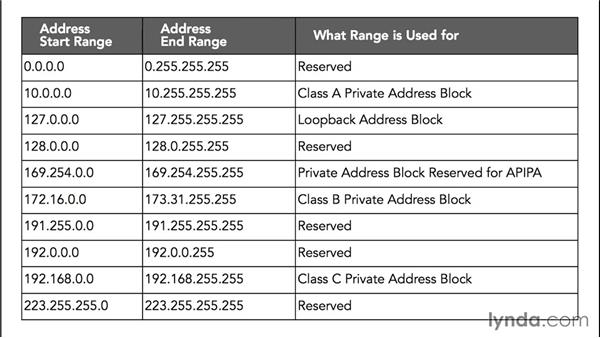

# **Intro to Networking/Refreshser**
---
## **MAC Addresses**
***Layer 2 of OSI model***
- This is our physical/machines address.
- Tells the network what kind of device is attached to the mac address.
- This is how we communicat over switches.
- Mac Address: xx:xx:xx:xx:xx:xx
- Use first three pairs of mac address are identifiers. `identify: xx:xx:xx`:xx:xx:xx
- Related to switching.
---
## **IP Addresses**
***Layer 3 of OSI model***
- Router Layer
Look at ipaddress and other network info with the *Linux*: `ifconfig` or *Windows*: `ipconfig`.

### **We will see 2 types of ip addresses**:
- IP addresses are layer 3 protocol
- #### **inet/IPv4** 
    - xxx.xxx.xxx.xxx  <-- Decimal
    
    - each octet is 8-bits range of 8 1's and 0's
    
    - **EXAMPLE:**
            
            - 128 64 32 16 8 4 2 1
            1   1  1  1 1 1 1 1 = 255

            - 128 64 32 16 8 4 2 1
            0   0  0  0 0 1 1 1 = 7

    - We use NAT or Network Address Traslation, this allows us to use ipv4 inside of our network. NAT asigns private ip address spaces. 

    - 
    - 
- #### **inet6/IPv6** 
    - xxxx::xxx:xxxx:xxxx:xxxx <-- Hexa Decimal
---
## **TCP, UDP, and the Three-Way Handshake**
***Layer 4 of OSI model***
- Transport layer

- ### **What is TCP**
    - **Transmission Control Protocol**
        - Connection oriented protocol
        - Higher reliability
        - EX: http, https, ssh, ftp
        - TCP works on a 3-way handshake
            1. SYN -- extend hand
            1. SYN ACK -- recipient sees hand and acknowlages
            1. ACK -- recipient extends hand to complete handshake with whomever initialized the handshake
        

- ### **What is UDP**
    - **User Datagram Protocol**
        - Connectionless protocol
        - EX: streamming service, DNS, VoIP
---
## **Common Ports and Protocols**
- ### **TCP Ports**
    - **FTP (21)**
        - File Transfer Protocol
        - get and store files
    - **SSH (22)**
        - Secure Shell
        - encrypted remote login 
    - **Telnet (23)**
        - ability to log into machine remotely
    - **SMTP (25)**
        - handles mail
    - **DNS (53)**
        - Domain Name System
        - resolve ip addresses to human readable names
    - **HTTP (80) / HTTPS (443)**
        - website
        - port 80 is non-secure
        - port 443 is secure
    - **POP3 (110)**
        - handles mail
    - **SMB (139 & 445)**
        - file share ports
        - we will see these a lot
        - wanna cry virus was an SMB exploit
    - **IMAP (143)**
        - handles mail

- ### **UDP Ports**
    - **DNS (53)**
        - read above in TCP
    - **DHCP (67, 68)**
        - pool of ip address to be assigned when a system connects
    - **TFTP (69)**
        - trivial ftp
    - **SNMP (161)**
        - Simple Network Management Protocol
---
## **The OSI Model**
- ### **1. P**
    - **Physical Layer**
        - data cables
        - fiber
        - servers
        - data centers
- ### **2. D**
    - **Data Layer**
        - switching
        - mac addresses
- ### **3. N**
    - **Network Layer**
        - ip addresses
        - routing
- ### **4. T**
    - **Trasport Layer**
        - TCP
        - UDP
- ### **5. S**
    - **Session Layer**
        - session management
- ### **6. P**
    - **Presentation Layer**
        - WMV, JPEG, MOV, MP3
        - Media
- ### **7. A**
    - **Application Layer**
        - HTTP
        - HTTPS
        - SMTP
---
## **Subnetting**
- netmask 255.255.255.0
- https://www.youtube.com/watch?v=ZxAwQB8TZsM
---